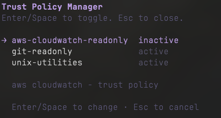

# pi-trust-policy

Bash command allowlist system for [pi](https://github.com/earendil-works/pi). Group trusted commands into policies, toggle them on/off, and get prompted for anything not covered.

## Install

```bash
pi install git:github.com/biratkk/pi-trust-policy
```

Or for a quick test:

```bash
pi -e git:github.com/biratkk/pi-trust-policy
```

## Usage

### 1. Write a policy YAML file

Create `~/.pi/agent/trust-policy/my-dev-tools.yaml`:

```yaml
name: my-dev-tools
description: Development commands for my project

includes:
  - unix-read

commands:
  - glob: "npm run *"
    description: "Run package scripts"
    pipe: true
  - glob: "docker build {*,*/**}"
    description: "Build Docker images"
    redirect: append
```

### 2. Activate it

Run `/trust-policy` in pi to open the TUI manager. Type to fuzzy-search, Enter/Space to cycle through activation states:

| State | Meaning |
|-------|--------|
| `inactive` | Not active anywhere |
| `local` | Active in project `.pi/trust-policy/` only |
| `global` | Active in `~/.pi/agent/trust-policy/` (all projects) |
| `global & local` | Active in both scopes |



Or manually create `~/.pi/agent/trust-policy/policy.json`:

```json
{
  "active": ["unix-read"]
}
```

### 3. Work normally

Trusted commands run without interruption. Untrusted commands prompt you with options to allow once, deny, or persist to a group.

## Commands

| Command | Description |
|---------|-------------|
| `/trust-policy` | Open TUI manager — toggle policies active/inactive |

## Policy Format

```yaml
name: my-policy
description: What this policy covers

includes:                    # optional: inherit from other groups
  - grep-read
  - cat-read

commands:
  - glob: "docker build *"
    description: "Build images"  # optional
    pipe: false                  # allow in pipelines (default: false)
    embedded: false              # allow in $() substitutions (default: false)
    redirect: none               # none | append | overwrite | both (default: none)
```

### Redirect Modes

| Value | Allows |
|-------|--------|
| `none` | No redirects — command must run without `>` or `>>` |
| `append` | `>>` only |
| `overwrite` | `>` only |
| `both` | Both `>` and `>>` |

## Starters

Built-in starter policies are organized by risk level and can be activated from the TUI:

| Policy | Category | Includes |
|--------|----------|----------|
| **unix-read** | Safe | grep, cat, ls, head, tail, wc, find, cut, sort |
| **unix-write** | Modifying | sed, awk, tee, cp, curl -o, sort -o |
| **unix-dangerous** | Destructive | rm, shred, truncate, mv |

Each aggregate policy composes per-tool policies (e.g., `unix-read` includes `grep-read`, `cat-read`, etc.). Per-tool policies live in subdirectories under `~/.pi/agent/trust-policy/policies/` and can also be activated individually for granular control.

On first session start, starters are migrated to `~/.pi/agent/trust-policy/policies/`. You own the copies and can freely edit them.

## How It Works

1. At session start, migrates bundled starter policies to `~/.pi/agent/trust-policy/policies/` (only new files, preserves edits)
2. Loads `policy.json` from global (`~/.pi/agent/trust-policy/`) and local (`.pi/trust-policy/`) directories
3. Resolves all active groups and their `includes` recursively (with cycle detection)
4. Intercepts every `bash` tool call and validates against the merged allowlist
5. Recursively parses compound commands (pipelines, `&&`/`||`/`;`, `$()`, `bash -c`) using [unbash](https://github.com/webpro-nl/unbash)
6. Validates redirect operators (`>`, `>>`) against each entry's `redirect` permission
7. Commands with env vars, `eval`, or unparseable elements always prompt

## Security Model

- **Pure allowlist** — only explicitly permitted commands run without confirmation
- **Fail-safe defaults** — `pipe: false`, `embedded: false`, `redirect: none`
- **Redirect enforcement** — `>` and `>>` require explicit `redirect` permission on the matching entry
- **Env vars always prompt** — `VAR=val cmd` and `export` trigger confirmation
- **Recursive validation** — every segment of a compound command is checked independently

## File Structure

```
~/.pi/agent/trust-policy/              # global
├── policy.json                        # {"active": ["unix-read", "unix-write"]}
├── policies/                          # migrated starters (source of truth)
│   ├── unix-read.yaml                 # aggregate: includes per-tool policies
│   ├── unix-write.yaml
│   ├── unix-dangerous.yaml
│   ├── grep/
│   │   └── grep-read.yaml             # per-tool policy
│   ├── sed/
│   │   └── sed-write.yaml
│   └── rm/
│       └── rm-destructive.yaml
└── my-custom-policy.yaml              # user-created policies

<project>/.pi/trust-policy/            # local (project-scoped)
├── policy.json
└── project-scripts.yaml
```

Both scopes merge additively. Local policies apply only within that project tree.

## License

MIT
